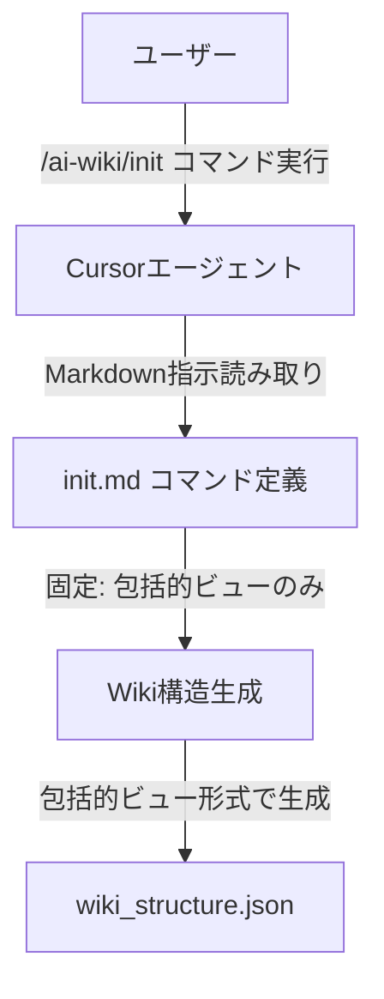

# Design Document: init-comprehensive-view-only

## Overview

この機能は、`/ai-wiki/init`コマンドを「包括的ビュー」のみを生成するように制限します。既存のコマンド定義では`${isComprehensiveView}`変数による条件分岐で包括的ビューと簡潔ビューの両方をサポートしていますが、この機能により簡潔ビューのオプションを削除し、常に包括的ビュー（セクション階層構造とページの親子関係を含む完全なJSON構造）のみを生成するようにします。

**Purpose**: `/ai-wiki/init`コマンドが常に包括的ビュー形式のJSON構造を生成するようにし、簡潔ビューと包括的ビューの選択の複雑さを排除します。

**Users**: Cursorエージェントを使用してWiki構造を生成する開発者

**Impact**: 既存の多ビュー対応機能を削除し、包括的ビューのみの固定動作に変更します。

### Goals
- `${isComprehensiveView}`変数による条件分岐を削除
- 簡潔ビュー生成ロジックを完全に削除
- 包括的ビューの生成ロジックのみを残す
- コマンド定義を簡素化し、包括的ビューのみに焦点を当てる
- 既存の包括的ビュー機能を完全に維持し、後方互換性を保証する

### Non-Goals
- 既存の包括的ビュー生成ロジックの変更（維持対象）
- 既存の変数（`${inputDir}`, `${fileTree}`, `${readme}`）の変更（維持対象）
- 既存のファイル操作パターンの変更（維持対象）
- 新規コンポーネントの作成（既存コンポーネントの修正のみ）

## Architecture

### Existing Architecture Analysis

**現在のアーキテクチャパターン**:
- Markdownベースのコマンド定義システム
- CursorエージェントがMarkdownファイルを読み取り、`<instructions>`セクションの指示に従って処理を実行
- 動的変数展開（`${variable}`形式）を使用
- 96-168行目で`${isComprehensiveView}`変数を使用した多ビュー対応の条件分岐を実装

**既存のドメイン境界**:
- コマンド定義は`.cursor/commands/ai-wiki/init.md`に配置
- 変数展開パターンはエージェントの実行時処理に依存

**統合ポイント**:
- 既存の`init.md`コマンド定義ファイルの以下の箇所を編集:
  - 30-31行目: 出力形式の説明から簡潔ビューの記述を削除
  - 96-168行目: `${isComprehensiveView}`条件分岐を削除し、包括的ビューのコードのみを残す
  - 181行目: 条件分岐を削除し、固定値（8-12ページ）に変更
  - 226-227行目: Output Descriptionから簡潔ビューの記述を削除
- 他の変数（`${inputDir}`, `${fileTree}`, `${readme}`）は変更しない

### Architecture Pattern & Boundary Map

**Architecture Integration**:
- **Selected pattern**: 既存コマンド修正パターン（Modification Pattern）
- **Domain/feature boundaries**: コマンド定義レイヤー（`.cursor/commands/ai-wiki/init.md`）の特定箇所のみを変更
- **Existing patterns preserved**: 変数展開パターン（`${isComprehensiveView}`以外）、包括的ビュー機能、ファイル操作パターン
- **New components rationale**: 新規コンポーネントは不要、既存コマンド定義の修正のみ
- **Steering compliance**: Markdownベースのコマンド定義パターンを維持

### Technology Stack & Alignment

| Layer | Choice / Version | Role in Feature | Notes |
|-------|------------------|-----------------|-------|
| Command Definition | Markdown | コマンド指示の定義 | 既存パターンを維持、特定箇所を修正 |
| Runtime | Cursorエージェント | 指示の解釈と実行 | 既存の実行環境、変数展開処理の変更なし |
| Data Format | JSON | Wiki構造の出力形式 | 既存のJSON構造形式を維持 |

## System Flows

この機能は単純な文字列置換のため、複雑なフローは存在しません。既存のコマンド実行フローは変更されず、条件分岐部分のみが固定値に置き換わります。

## Requirements Traceability

| Requirement | Summary | Components | Interfaces | Flows |
|-------------|---------|------------|------------|-------|
| 1.1 | 常に包括的ビュー形式のJSON構造を生成 | init.mdコマンド定義 | なし | なし |
| 1.2 | `sections`配列を含む | init.mdコマンド定義 | なし | なし |
| 1.3 | 各ページに`parent_section`プロパティを含む | init.mdコマンド定義 | なし | なし |
| 1.4 | 8-12ページを含む | init.mdコマンド定義 | なし | なし |
| 1.5 | サブセクション階層構造をサポート | init.mdコマンド定義 | なし | なし |
| 2.1 | `${isComprehensiveView}`変数による条件分岐を含まない | init.mdコマンド定義 | なし | なし |
| 2.2 | 簡潔ビュー生成のコードパスを含まない | init.mdコマンド定義 | なし | なし |
| 2.3 | 簡潔ビューに関するドキュメント記述を含まない | init.mdコマンド定義 | なし | なし |
| 2.4 | 簡潔ビュー形式が要求されても包括的ビューを生成 | init.mdコマンド定義 | なし | なし |
| 3.1 | `${isComprehensiveView}`変数参照を削除 | init.mdコマンド定義 | なし | なし |
| 3.2 | `<background_information>`から簡潔ビューの説明を削除 | init.mdコマンド定義 | なし | なし |
| 3.3 | `<instructions>`から簡潔ビュー生成ロジックを削除 | init.mdコマンド定義 | なし | なし |
| 3.4 | `Output Description`から簡潔ビューの記述を削除 | init.mdコマンド定義 | なし | なし |
| 3.5 | 包括的ビューの生成ロジックのみを含む | init.mdコマンド定義 | なし | なし |
| 4.1 | 既存の包括的ビュー生成ロジックを維持 | init.mdコマンド定義 | なし | なし |
| 4.2 | 既存のJSON構造形式を維持 | init.mdコマンド定義 | なし | なし |
| 4.3 | 既存の変数の使用を維持 | init.mdコマンド定義 | なし | なし |
| 4.4 | 既存のファイル操作パターンを維持 | init.mdコマンド定義 | なし | なし |

## Components and Interfaces

### Component Summary

| Component | Domain/Layer | Intent | Req Coverage | Key Dependencies (P0/P1) | Contracts |
|-----------|--------------|--------|--------------|--------------------------|-----------|
| init.mdコマンド定義 | Command Definition | 包括的ビューのみを生成するWiki構造生成コマンド | 1.1-4.4 | Cursorエージェント (P0) | なし |

### Command Definition Layer

#### init.mdコマンド定義

| Field | Detail |
|-------|--------|
| Intent | `/ai-wiki/init`コマンドが常に包括的ビュー形式のJSON構造を生成するように制限する |
| Requirements | 1.1, 1.2, 1.3, 1.4, 1.5, 2.1, 2.2, 2.3, 2.4, 3.1, 3.2, 3.3, 3.4, 3.5, 4.1, 4.2, 4.3, 4.4 |
| Owner / Reviewers | (optional) |

**Responsibilities & Constraints**
- 包括的ビュー形式のJSON構造のみを生成する
- 簡潔ビュー生成ロジックを含まない
- `${isComprehensiveView}`変数による条件分岐を含まない
- 既存の包括的ビュー生成ロジックを完全に維持する
- 既存の変数（`${inputDir}`, `${fileTree}`, `${readme}`）の使用を維持する

**Dependencies**
- Inbound: Cursorエージェント — コマンド定義の解釈と実行 (P0)
- Outbound: なし
- External: なし

**Contracts**: なし（コマンド定義ファイルのため、インターフェース契約は不要）

**Implementation Notes**
- **Integration**: 既存のコマンド定義ファイル（`.cursor/commands/ai-wiki/init.md`）を修正
  - 30-31行目: 出力形式の説明から簡潔ビューの記述を削除
  - 96行目の`${isComprehensiveView ? \``を削除し、直接包括的ビューのコードを記述
  - 144行目の` : \``（簡潔ビューの開始）から168行目の`\`}`（条件分岐の終了）までを削除
  - 181行目の`${isComprehensiveView ? '8-12' : '4-6'}`を`8-12`に固定
  - 181行目の`${isComprehensiveView ? 'comprehensive' : 'concise'}`を`comprehensive`に固定
  - 226-227行目: Output Descriptionから簡潔ビューの記述を削除
- **Validation**: 
  - 修正後に既存の包括的ビュー機能が正常に動作することを確認
  - 生成されるJSON構造が既存の仕様と一致していることを確認
  - 簡潔ビュー関連のコードが残っていないことを確認
- **Risks**: 
  - 既存の包括的ビュー機能への影響はない（既存機能を完全に維持）
  - 既存のJSON構造への影響はない（既存構造を完全に維持）

## Data Models

### Domain Model

この機能は既存のJSON構造形式を維持するため、データモデルの変更はありません。

**既存のJSON構造形式**:
- `title`: Wikiのタイトル
- `description`: Wikiの説明
- `sections`: セクション配列（各セクションは`id`, `title`, `pages`, `subsections`を含む）
- `pages`: ページ配列（各ページは`id`, `title`, `description`, `importance`, `relevant_files`, `related_pages`, `parent_section`を含む）

### Logical Data Model

**Structure Definition**:
- セクション階層構造: `sections`配列にセクション情報を含む
- ページの親子関係: 各ページオブジェクトに`parent_section`プロパティを含む
- サブセクション階層: 各セクションに`subsections`配列を含む

**Consistency & Integrity**:
- すべてのセクションIDとページIDは一意である必要がある
- セクション参照（`subsections`配列内）は有効なセクションIDを参照する必要がある
- ページ参照（セクションの`pages`配列内）は有効なページIDを参照する必要がある
- ページの`parent_section`参照は有効なセクションIDを参照する必要がある

### Data Contracts & Integration

**API Data Transfer**
- 出力形式: JSON
- スキーマ: 既存の包括的ビュー形式を維持
- 検証: Dockerコンテナを使用したJSON構文検証

## Error Handling

### Error Strategy

既存のエラーハンドリングパターンを維持します。変更は条件分岐の削除のみであり、エラーハンドリングロジックへの影響はありません。

### Error Categories and Responses

既存のエラーハンドリングを維持:
- **入力ディレクトリ不存在エラー**: エラーメッセージを報告し、処理を中断
- **ディレクトリ操作エラー**: エラーメッセージを報告し、処理を中断
- **ファイル書き込みエラー**: エラーメッセージを報告し、処理を中断
- **JSON生成エラー**: エラーメッセージを報告し、処理を中断
- **JSON検証エラー**: エラーメッセージを報告し、処理を中断

### Monitoring

既存のモニタリングパターンを維持します。変更は条件分岐の削除のみであり、モニタリングロジックへの影響はありません。

## Testing Strategy

### Unit Tests
- 既存の包括的ビュー生成ロジックが正常に動作することを確認
- 生成されるJSON構造が既存の仕様と一致していることを確認
- 簡潔ビュー関連のコードが残っていないことを確認

### Integration Tests
- `/ai-wiki/init`コマンドが正常に実行されることを確認
- 生成されるJSONファイルが有効なJSON構文に準拠していることを確認
- 生成されるJSON構造が包括的ビュー形式であることを確認

### E2E Tests
- エンドツーエンドでコマンドが正常に実行され、包括的ビュー形式のJSONが生成されることを確認

## Supporting References

- `.cursor/commands/ai-wiki/init.md` — 既存のコマンド定義ファイル
- `.kiro/steering/tech.md` — 技術スタックとアーキテクチャパターン
- `.kiro/steering/structure.md` — プロジェクト構造と命名規則
- `.wiki/wiki_structure.json` — 既存の包括的ビュー出力例
- `.kiro/specs/init-comprehensive-view-only/research.md` — 研究ログと設計決定の詳細
