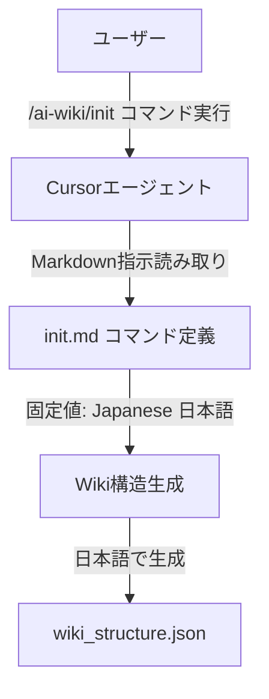

# Design Document: init-japanese-default

## Overview

この機能は、`/ai-wiki/init`コマンドから言語パラメータを削除し、常に日本語（'ja'）のみを使用するように変更します。

**Purpose**: `/ai-wiki/init`コマンドが常に日本語のみを対象として動作するようにし、言語指定の複雑さを排除します。

**Users**: Cursorエージェントを使用してWiki構造を生成する開発者

**Impact**: 既存の多言語対応機能を削除し、日本語のみの固定動作に変更します。

### Goals
- `${language}`変数の使用箇所を削除
- 多言語対応の条件分岐を削除し、固定値"Japanese (日本語)"に置き換え
- コマンド定義から言語パラメータ関連の処理を完全に削除
- 日本語以外の言語を指定できないようにする

### Non-Goals
- `${isComprehensiveView}`変数の変更（要件の対象外）
- 他のコマンドファイルへの影響（`${language}`変数は`ai-wiki/init.md`でのみ使用）
- テンプレートファイルの変更（言語パラメータはコマンド定義でのみ使用）
- コマンド引数の形式変更（既存の`repo/<指定ディレクトリ>`形式を維持）

## Architecture

### Existing Architecture Analysis

**現在のアーキテクチャパターン**:
- Markdownベースのコマンド定義システム
- CursorエージェントがMarkdownファイルを読み取り、`<instructions>`セクションの指示に従って処理を実行
- 動的変数展開（`${variable}`形式）を使用
- 86-96行目で`${language}`変数を使用した多言語対応の条件分岐を実装

**既存のドメイン境界**:
- コマンド定義は`.cursor/commands/ai-wiki/init.md`に配置
- 変数展開パターンはエージェントの実行時処理に依存

**統合ポイント**:
- 既存の`init.md`コマンド定義ファイルの86-96行目を編集
- 他の変数（`${inputDir}`, `${fileTree}`, `${readme}`, `${isComprehensiveView}`）は変更しない

### Architecture Pattern & Boundary Map

**Architecture Integration**:
- **Selected pattern**: 既存コマンド修正パターン（Modification Pattern）
- **Domain/feature boundaries**: コマンド定義レイヤー（`.cursor/commands/ai-wiki/init.md`）の86-96行目のみを変更
- **Existing patterns preserved**: 変数展開パターン（`${language}`以外）、包括的ビュー機能、ファイル操作パターン
- **New components rationale**: 新規コンポーネントは不要、既存コマンド定義の修正のみ
- **Steering compliance**: Markdownベースのコマンド定義パターンを維持

### Technology Stack

| Layer | Choice / Version | Role in Feature | Notes |
|-------|------------------|----------------|-------|
| Command Definition | Markdown | コマンド指示の定義 | 既存パターンを維持、86-96行目を修正 |
| Runtime | Cursorエージェント | 指示の解釈と実行 | 既存の実行環境、変数展開処理の変更なし |

## System Flows

この機能は単純な文字列置換のため、複雑なフローは存在しません。既存のコマンド実行フローは変更されず、言語指定部分のみが固定値に置き換わります。

## Requirements Traceability

| Requirement | Summary | Components | Interfaces | Flows |
|-------------|---------|------------|------------|-------|
| 1.1 | 言語パラメータを受け付けない | init.md (86-96行目) | なし | なし |
| 1.2 | `${language}`変数を使用しない | init.md (86-96行目) | なし | なし |
| 1.3 | 言語パラメータを無視する | init.md (86-96行目) | なし | なし |
| 1.4 | 言語パラメータ関連の処理を削除 | init.md (86-96行目) | なし | なし |
| 2.1 | 常に日本語（'ja'）を使用 | init.md (86-96行目) | なし | なし |
| 2.2 | 言語判定ロジックを削除 | init.md (86-96行目) | なし | なし |
| 2.3 | "Japanese (日本語)"を明示的に指定 | init.md (86-96行目) | なし | なし |
| 2.4 | 多言語対応の条件分岐を削除 | init.md (86-96行目) | なし | なし |
| 3.1 | 言語パラメータを静かに無視 | init.md (86-96行目) | なし | なし |
| 3.2 | 言語パラメータを処理しない | init.md (86-96行目) | なし | なし |
| 3.3 | 日本語以外の言語コードを認識しない | init.md (86-96行目) | なし | なし |
| 3.4 | 日本語（'ja'）をデフォルトとして使用 | init.md (86-96行目) | なし | なし |

## Components and Interfaces

| Component | Domain/Layer | Intent | Req Coverage | Key Dependencies (P0/P1) | Contracts |
|-----------|-------------|--------|--------------|--------------------------|-----------|
| init.md (86-96行目) | Command Definition | 言語指定を固定値に置き換え | 1.1-1.4, 2.1-2.4, 3.1-3.4 | Cursorエージェント (P0) | なし |

### Command Definition Layer

#### init.md (86-96行目修正)

| Field | Detail |
|-------|--------|
| Intent | 多言語対応の条件分岐を削除し、固定値"Japanese (日本語)"に置き換える |
| Requirements | 1.1, 1.2, 1.3, 1.4, 2.1, 2.2, 2.3, 2.4, 3.1, 3.2, 3.3, 3.4 |

**Responsibilities & Constraints**
- 86-96行目の`${language}`変数を使用した11行の条件分岐を削除
- 固定文字列"IMPORTANT: The wiki content will be generated in Japanese (日本語) language."に置き換え
- 他の変数（`${inputDir}`, `${fileTree}`, `${readme}`, `${isComprehensiveView}`）は変更しない
- コマンド引数の形式は変更しない

**Dependencies**
- Inbound: Cursorエージェント — コマンド定義の読み取りと実行 (P0)
- Outbound: なし
- External: なし

**Contracts**: なし（Markdownファイルの編集のみ）

**Implementation Notes**
- **Integration**: 既存のコマンド実行フローに影響なし。変数の削除のみ。
- **Validation**: 修正後のMarkdownファイルが有効な構文であることを確認。他の変数が正しく機能することを確認。
- **Risks**: 低リスク。単純な文字列置換のため、既存機能への影響は最小限。

## Data Models

この機能はデータモデルの変更を伴いません。Markdownファイルの文字列置換のみです。

## Error Handling

この機能は既存のエラーハンドリングフローに影響しません。言語パラメータが指定されても、変数が存在しないため静かに無視されます（要件3.1に準拠）。

## Testing Strategy

### Unit Tests
- 修正後の`init.md`ファイルが有効なMarkdown構文であることを確認
- 86-96行目が固定値"Japanese (日本語)"に置き換えられていることを確認
- 他の変数（`${inputDir}`, `${fileTree}`, `${readme}`, `${isComprehensiveView}`）が正しく機能することを確認

### Integration Tests
- `/ai-wiki/init`コマンドを実行し、常に日本語でWiki構造が生成されることを確認
- コマンド引数の形式（`repo/<指定ディレクトリ>`）が変更されていないことを確認
- 既存の機能（ディレクトリ操作、ファイル読み取り、JSON出力）が正常に動作することを確認

### E2E Tests
- 実際のリポジトリディレクトリに対して`/ai-wiki/init`コマンドを実行
- 生成された`wiki_structure.json`が日本語で記述されていることを確認
- 多言語対応の条件分岐が削除され、固定値のみが使用されていることを確認

## Supporting References

- 既存のコマンド定義: `.cursor/commands/ai-wiki/init.md`
- ギャップ分析: `.kiro/specs/init-japanese-default/gap-analysis.md`
- 要件定義: `.kiro/specs/init-japanese-default/requirements.md`
