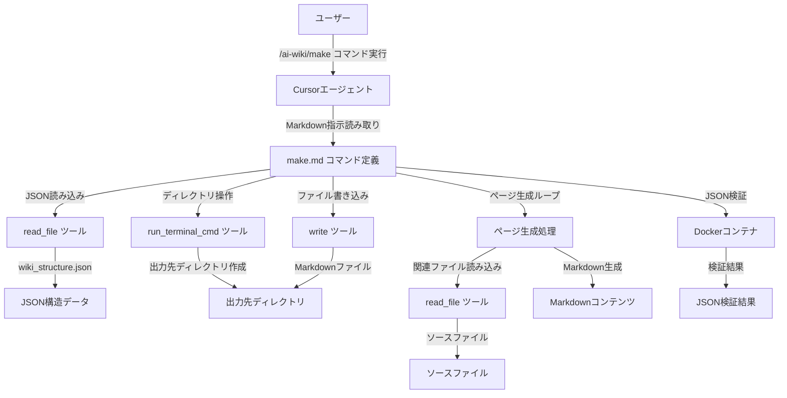
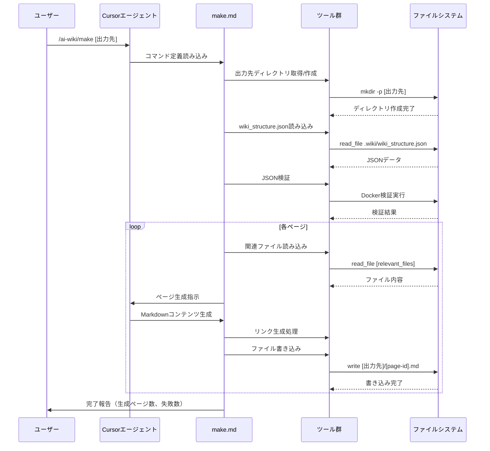

# Design Document: make-wiki-command

## Overview

この機能は、`/ai-wiki/make`コマンドを拡張し、`.wiki/wiki_structure.json`を読み込んで、定義された全ページのWikiコンテンツをMarkdown形式で生成する機能を提供します。

**Purpose**: 開発者が`/ai-wiki/init`コマンドで生成したWiki構造定義（`wiki_structure.json`）を基に、実際のWikiページを自動生成できるようにします。

**Users**: Cursorエージェントを使用してWikiページを生成する開発者

**Impact**: 既存の`make.md`コマンド定義を大幅に拡張し、JSON読み込み、ループ処理、出力先指定、セクション構造維持、リンク生成の機能を追加します。

### Goals
- `wiki_structure.json`を読み込んで、定義された全ページのWikiコンテンツを生成
- 出力先ディレクトリを引数で指定可能にする
- セクション構造を維持したWikiページを生成
- ページ間のリンクを適切に生成
- 既存のページ生成指示を維持しつつ、新機能を追加

### Non-Goals
- セクション構造をディレクトリ階層で表現する機能（フラット構造を採用）
- ページ生成の並列化（将来の拡張として検討可能）
- 既存のページ生成指示の変更

## Architecture

### Existing Architecture Analysis

**現在のアーキテクチャパターン**:
- Markdownベースのコマンド定義システム
- CursorエージェントがMarkdownファイルを読み取り、`<instructions>`セクションの指示に従って処理を実行
- 動的変数展開（`${variable}`形式）を使用
- 既存の`init.md`コマンドでJSON検証、ディレクトリ操作、エラーハンドリングのパターンが確立

**既存のドメイン境界**:
- コマンド定義は`.cursor/commands/`ディレクトリに配置
- 各コマンドは独立したMarkdownファイル
- ファイル操作やディレクトリ操作はエージェントの動的処理に依存

**統合ポイント**:
- 既存の`make.md`コマンド定義ファイルを拡張
- 既存のページ生成指示を維持
- 既存のパターン（`init.md`のJSON検証、ディレクトリ操作）を再利用

### Architecture Pattern & Boundary Map

**Architecture Integration**:
- Selected pattern: 既存コマンド定義の拡張パターン
- Domain/feature boundaries: コマンド定義ファイル内で完結し、外部コンポーネントへの依存なし
- Existing patterns preserved: JSON検証（Docker使用）、ディレクトリ操作、エラーハンドリングのパターンを再利用
- New components rationale: 既存の`make.md`を拡張することで、既存のページ生成指示を維持しつつ、新機能を追加
- Steering compliance: Markdownベースのコマンド定義システム、日本語優先、Spec-Driven Developmentの原則を維持

### Technology Stack

| Layer | Choice / Version | Role in Feature | Notes |
|-------|------------------|-----------------|-------|
| CLI / Commands | Cursorエージェントコマンドシステム | コマンド実行環境 | 既存の技術スタック |
| Data / Storage | JSON | `wiki_structure.json`の読み込みと検証 | 既存の技術スタック |
| Infrastructure / Runtime | Docker (python:3-alpine) | JSON検証に使用 | 既存のパターンを再利用 |
| File System | Markdown | Wikiページの生成と保存 | 既存の技術スタック |

## System Flows

### Wiki生成フロー

**主要な決定事項**:
- 各ページの生成は順次実行（並列化は将来の拡張として検討可能）
- 部分的な失敗時は成功したページを保存し、失敗したページについてのみエラーを報告
- JSON検証は`init.md`のパターンを再利用（Dockerコンテナを使用）

## Requirements Traceability

| Requirement | Summary | Components | Interfaces | Flows |
|-------------|---------|------------|------------|-------|
| 1.1-1.6 | wiki_structure.jsonの読み込みと検証 | make.mdコマンド定義 | read_file, run_terminal_cmd | JSON読み込みフロー |
| 2.1-2.5 | 出力先ディレクトリの指定 | make.mdコマンド定義 | run_terminal_cmd | ディレクトリ作成フロー |
| 3.1-3.9 | Wikiページの生成 | make.mdコマンド定義（ページ生成指示） | read_file, write | ページ生成フロー |
| 4.1-4.5 | セクション構造の維持 | make.mdコマンド定義 | - | ページ生成フロー |
| 5.1-5.5 | ページ間のリンク生成 | make.mdコマンド定義 | - | リンク生成処理 |
| 6.1-6.5 | ファイル出力と構造化 | make.mdコマンド定義 | write | ファイル書き込みフロー |
| 7.1-7.5 | エラーハンドリングと検証 | make.mdコマンド定義 | - | エラーハンドリング |
| 8.1-8.6 | コマンド定義の更新 | make.mdコマンド定義 | - | - |

## Components and Interfaces

### コマンド定義レイヤー

#### make.mdコマンド定義

| Field | Detail |
|-------|--------|
| Intent | `wiki_structure.json`を読み込んで、定義された全ページのWikiコンテンツを生成するコマンド定義 |
| Requirements | 1.1-1.6, 2.1-2.5, 3.1-3.9, 4.1-4.5, 5.1-5.5, 6.1-6.5, 7.1-7.5, 8.1-8.6 |
| Owner / Reviewers | - |

**Responsibilities & Constraints**
- `wiki_structure.json`の読み込みと検証
- 出力先ディレクトリの取得と作成
- 全ページの生成ループ処理
- セクション構造の維持（フラット構造で実装）
- ページ間リンクの生成
- エラーハンドリングと進捗報告
- 既存のページ生成指示を維持

**Dependencies**
- Inbound: なし
- Outbound: 
  - `read_file`ツール — JSONファイルとソースファイルの読み込み (P0)
  - `write`ツール — Markdownファイルの書き込み (P0)
  - `run_terminal_cmd`ツール — ディレクトリ操作とJSON検証 (P0)
  - `list_dir`ツール — ディレクトリ構造の取得 (P1)
- External: 
  - Docker (python:3-alpine) — JSON検証に使用 (P0)

**Contracts**: Service [ ] / API [ ] / Event [ ] / Batch [ ] / State [ ]

**Implementation Notes**
- Integration: 既存の`make.md`を大幅に拡張し、JSON読み込み、ループ処理、出力先指定、セクション構造維持、リンク生成の機能を追加
- Validation: JSON構文検証はDockerコンテナを使用（`init.md`のパターンを再利用）
- Risks: 
  - ファイルサイズが大きくなる可能性（200-300行程度）
  - 大量のページ生成時に時間がかかる可能性（将来の並列化を検討）

## Data Models

### Domain Model

**Wiki構造データモデル**:
- `WikiStructure`: ルートエンティティ
  - `title`: Wikiのタイトル
  - `description`: Wikiの説明
  - `sections`: セクション配列
  - `pages`: ページ配列

**セクションエンティティ**:
- `Section`: セクション定義
  - `id`: セクションID（一意）
  - `title`: セクションタイトル
  - `pages`: ページID配列
  - `subsections`: サブセクションID配列

**ページエンティティ**:
- `Page`: ページ定義
  - `id`: ページID（一意）
  - `title`: ページタイトル
  - `description`: ページ説明
  - `importance`: 重要度（high/medium/low）
  - `relevant_files`: 関連ファイルパス配列
  - `related_pages`: 関連ページID配列
  - `parent_section`: 親セクションID

**不変条件**:
- セクションIDとページIDは一意である必要がある
- ページの`parent_section`は有効なセクションIDを参照する必要がある
- セクションの`pages`配列は有効なページIDを参照する必要がある
- セクションの`subsections`配列は有効なセクションIDを参照する必要がある

### Logical Data Model

**ファイルシステム構造**:
- 出力先ディレクトリ: `{output-dir}/`
  - 各ページ: `{page-id}.md`（フラット構造）

**ファイル名生成規則**:
- ページIDをそのままファイル名として使用（`{page-id}.md`）
- 無効文字が含まれる場合は`-`に置換（通常は発生しない）

**リンクパス生成規則**:
- 相対パス: `{page-id}.md`（フラット構造の場合）
- ページIDからファイルパスへのマッピング: `{page-id}` → `{page-id}.md`

### Data Contracts & Integration

**JSON構造（入力）**:
- ファイルパス: `.wiki/wiki_structure.json`
- スキーマ: `WikiStructure`エンティティに対応
- 検証: Dockerコンテナを使用したJSON構文検証

**Markdownファイル（出力）**:
- ファイルパス: `{output-dir}/{page-id}.md`
- 形式: Markdown形式
- エンコーディング: UTF-8

## Error Handling

### Error Strategy

**エラーカテゴリと対応**:

1. **ファイル不存在エラー**:
   - `.wiki/wiki_structure.json`が存在しない場合: エラーメッセージを報告し、処理を中断
   - `relevant_files`に指定されたファイルが存在しない場合: エラーメッセージを報告し、そのページの生成をスキップ

2. **JSON構文エラー**:
   - JSONファイルの構文が無効な場合: エラーメッセージを報告し、処理を中断
   - Docker検証に失敗した場合: エラーメッセージを報告し、処理を中断

3. **ディレクトリ操作エラー**:
   - 出力先ディレクトリの作成に失敗した場合: エラーメッセージを報告し、処理を中断

4. **ファイル書き込みエラー**:
   - Markdownファイルの書き込みに失敗した場合: エラーメッセージを報告し、そのページの生成をスキップ（他のページの生成は継続）

5. **セクション構造エラー**:
   - 存在しないセクションIDへの参照がある場合: エラーメッセージを報告し、処理を中断または無効な参照をスキップ

### Monitoring

- 処理の完了時に、生成されたページ数と失敗したページ数（該当する場合）を報告
- 生成されたファイルのパスをユーザーに報告
- エラーメッセージは日本語で明確に報告

## Testing Strategy

### Unit Tests
- JSON読み込みと検証のロジック
- ファイル名生成ロジック（ページIDからファイル名への変換）
- リンク生成ロジック（ページIDからリンクパスへの変換）
- 無効文字のエスケープ処理

### Integration Tests
- `wiki_structure.json`の読み込みから全ページ生成までのフロー
- セクション構造の維持（フラット構造での実装）
- ページ間リンクの生成
- エラーハンドリング（部分的な失敗時の処理）

### E2E Tests
- `/ai-wiki/make`コマンドの実行から完了までのフロー
- 出力先ディレクトリの指定と作成
- 生成されたWikiページの内容確認

### Performance/Load
- 大量のページ（50+ページ）を生成する際のパフォーマンス
- JSON検証の実行時間
