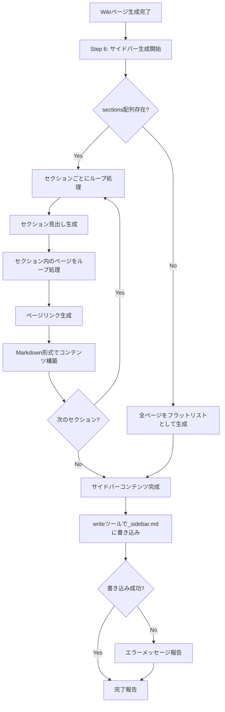

# Design Document: make-wiki-sidebar

## Overview

この機能は、`/ai-wiki/make`コマンドを拡張し、Wikiページ生成時にサイドバーファイル（`_sidebar.md`）も自動生成する機能を提供します。

**Purpose**: 開発者が`/ai-wiki/make`コマンドを実行した際に、Wikiページと同時にサイドバーファイルも生成されるようにし、生成されたWikiにナビゲーション機能を提供します。

**Users**: Cursorエージェントを使用してWikiページを生成する開発者

**Impact**: 既存の`make.md`コマンド定義にサイドバー生成処理を追加し、Wikiページ生成の完了後にサイドバーファイルを自動生成します。

### Goals
- Wikiページ生成時にサイドバーファイル（`_sidebar.md`）を自動生成
- `wiki_structure.json`のセクション構造を反映した階層的なナビゲーションを提供
- 標準的なMarkdown形式でサイドバーを生成（GitBook、Docsifyなどで利用可能）
- 既存のWikiページ生成処理に影響を与えない統合

### Non-Goals
- サイドバーのカスタマイズ機能（将来的な拡張として検討可能）
- サイドバーの動的生成（静的Markdownファイルとして生成）
- サイドバーのテーマやスタイル設定（Wikiシステム側で処理）

## Architecture

### Existing Architecture Analysis

**現在のアーキテクチャパターン**:
- Markdownベースのコマンド定義システム
- CursorエージェントがMarkdownファイルを読み取り、`<instructions>`セクションの指示に従って処理を実行
- 動的変数展開（`${variable}`形式）を使用
- 既存の`make.md`コマンドでJSON読み込み、ループ処理、ファイル書き込み、エラーハンドリングのパターンが確立

**既存のドメイン境界**:
- コマンド定義は`.cursor/commands/`ディレクトリに配置
- 各コマンドは独立したMarkdownファイル
- ファイル操作やディレクトリ操作はエージェントの動的処理に依存

**統合ポイント**:
- `wiki_structure.json`の読み込み: 既に`make.md`で実装済み（`${wikiStructure}`, `${sections}`, `${pages}`変数が利用可能）
- 出力先ディレクトリ: 既に`make.md`で実装済み（`${outputDir}`変数が利用可能）
- ファイル書き込み: `write`ツールが既に使用されている（サイドバー生成でも再利用可能）
- セクション構造の解析: 既に`make.md`で実装済み（`${sectionMap}`変数が利用可能）

### Architecture Pattern & Boundary Map

**選択パターン**: 既存コマンド拡張パターン（Option A）

**アーキテクチャ統合**:
- 選択パターン: 既存の`make.md`を拡張するアプローチ
- ドメイン/機能境界: サイドバー生成処理は既存のWikiページ生成処理と明確に分離（Step 6として独立）
- 既存パターンの維持: JSON読み込み、ファイル書き込み、エラーハンドリングのパターンを再利用
- 新規コンポーネントの理由: 新規コンポーネントは不要、既存のコマンド定義を拡張
- Steering準拠: Markdownベースのコマンド定義システム、日本語優先、Spec-Driven Developmentの原則を維持

### Technology Stack

| Layer | Choice / Version | Role in Feature | Notes |
|-------|------------------|-----------------|-------|
| Command Definition | Markdown | コマンド定義と処理指示 | 既存の`make.md`を拡張 |
| Runtime | Cursorエージェント | コマンド実行とファイル操作 | 既存のエージェント機能を利用 |
| File I/O | `write`ツール | サイドバーファイルの書き込み | 既存のパターンを再利用 |
| Data Format | JSON, Markdown | データ構造と出力形式 | `wiki_structure.json`の読み込み、Markdown形式のサイドバー生成 |

## System Flows

### サイドバー生成フロー



**フローレベル決定事項**:
- サイドバー生成はWikiページ生成の完了後（Step 5の後）に実行
- `sections`配列が存在しない場合（簡潔ビュー）は、全ページをフラットなリストとして生成
- エラーが発生してもWikiページ生成の結果には影響を与えない（エラーメッセージのみ報告）

## Requirements Traceability

| Requirement | Summary | Components | Interfaces | Flows |
|-------------|---------|------------|------------|-------|
| 1.1-1.5 | サイドバーファイルの生成 | make.md Step 6 | writeツール | サイドバー生成フロー |
| 2.1-2.6 | セクション構造に基づくナビゲーション階層 | make.md Step 6 | sections配列、sectionMap | セクションループ処理 |
| 3.1-3.5 | ページリンクの生成 | make.md Step 6 | pages配列 | ページリンク生成処理 |
| 4.1-4.5 | サイドバーのMarkdown形式 | make.md Step 6 | Markdown形式生成ロジック | コンテンツ構築処理 |
| 5.1-5.5 | 既存コマンドとの統合 | make.md | 既存の処理フロー | 統合フロー |
| 6.1-6.5 | エラーハンドリングと検証 | make.md Step 6 | エラーハンドリングロジック | エラー処理フロー |
| 7.1-7.5 | サイドバーの構造とフォーマット | make.md Step 6 | フォーマット生成ロジック | コンテンツ構築処理 |

## Components and Interfaces

### Command Definition Layer

#### make.md (拡張)

| Field | Detail |
|-------|--------|
| Intent | Wikiページ生成とサイドバー生成を統合したコマンド定義 |
| Requirements | 1.1-1.5, 2.1-2.6, 3.1-3.5, 4.1-4.5, 5.1-5.5, 6.1-6.5, 7.1-7.5 |
| Owner / Reviewers | (optional) |

**Responsibilities & Constraints**
- Wikiページ生成処理の維持（既存のStep 1-5）
- サイドバー生成処理の追加（新規のStep 6）
- 既存の変数（`${wikiStructure}`, `${sections}`, `${pages}`, `${outputDir}`）の再利用
- エラーハンドリングパターンの維持

**Dependencies**
- Inbound: `wiki_structure.json` — Wiki構造データの読み込み (P0)
- Outbound: `write`ツール — サイドバーファイルの書き込み (P0)
- External: Cursorエージェント — コマンド実行環境 (P0)

**Contracts**: Service [ ] / API [ ] / Event [ ] / Batch [ ] / State [ ]

##### Implementation Notes
- **統合**: Step 6を既存の処理フローに追加し、Wikiページ生成の完了後に実行
- **検証**: サイドバー生成の成功/失敗を完了報告に含める
- **リスク**: サイドバー生成の失敗がWikiページ生成に影響を与えないようにエラーハンドリングを実装

## Data Models

### Domain Model

**サイドバー生成のドメインモデル**:
- **入力**: `wiki_structure.json`（`sections`配列、`pages`配列、`title`）
- **処理**: セクション構造の解析、ページリンクの生成、Markdown形式への変換
- **出力**: `_sidebar.md`（Markdown形式のサイドバーファイル）

**エンティティ**:
- **Section**: セクションID、タイトル、ページID配列、サブセクション配列
- **Page**: ページID、タイトル、親セクションID
- **Sidebar**: Markdown形式のナビゲーションコンテンツ

### Logical Data Model

**サイドバーのMarkdown形式**:

```markdown
## Section Title

- [Page Title](page-id)

  - [Sub Page Title](sub-page-id)

## Next Section Title

- [Page Title](page-id)
```

**構造定義**:
- セクション見出し: `## Section Title`（H2見出し）
- トップレベルのページリンク: `- [Page Title](page-id)`（`.md`拡張子は含めない）
- サブレベルのページリンク: `  - [Page Title](page-id)`（2スペースのインデント）
- セクション間の空行: 可読性向上のため空行を挿入

**一貫性と整合性**:
- ページIDからファイルパスへのマッピング: `{page-id}`形式（`.md`拡張子は含めない）
- セクションの順序: `sections`配列の順序に従う
- ページの順序: 各セクションの`pages`配列の順序に従う
- 階層構造: `subsections`配列が存在する場合はインデントで表現（将来の拡張）

## Error Handling

### Error Strategy

サイドバー生成のエラーハンドリングは、既存のWikiページ生成処理に影響を与えないように設計します。

### Error Categories and Responses

**ユーザーエラー** (4xx相当):
- セクション構造の解析エラー: エラーメッセージを報告し、サイドバー生成をスキップ（Wikiページ生成は継続）
- ページタイトルが存在しない: ページIDをフォールバックとして使用

**システムエラー** (5xx相当):
- ファイル書き込み失敗: エラーメッセージを報告し、サイドバー生成をスキップ（Wikiページ生成は継続）
- メモリ不足: エラーメッセージを報告し、処理を中断（Wikiページ生成も中断）

**ビジネスロジックエラー** (422相当):
- `sections`配列が存在しない: 簡潔ビューとして全ページをフラットなリストとして生成（エラーではない）
- セクションにページが存在しない: セクション見出しのみを生成（エラーではない）

### Monitoring

- サイドバー生成の成功/失敗を完了報告に含める
- エラーメッセージは日本語で明確に報告
- 生成されたサイドバーファイルのパスをユーザーに報告

## Testing Strategy

### Unit Tests
- セクション構造からMarkdown形式への変換ロジック
- ページIDからファイルパスへのマッピング（`.md`拡張子を含めない形式）
- 階層構造のインデント処理（サブレベルは2スペース）
- ページタイトルが存在しない場合のフォールバック処理

### Integration Tests
- Wikiページ生成とサイドバー生成の統合フロー
- `sections`配列が存在しない場合（簡潔ビュー）の処理
- エラー発生時のWikiページ生成への影響確認

### E2E Tests
- `/ai-wiki/make`コマンド実行時のサイドバー生成確認
- 生成された`_sidebar.md`の形式検証
- サイドバー生成の失敗がWikiページ生成に影響を与えないことの確認

## Supporting References

### サイドバーのMarkdown形式の詳細

**確定事項**:
- ページリンクの形式: `[Page Title](page-id)`（`.md`拡張子は含めない）
- 階層構造: インデントで表現（サブレベルは2スペースのインデント）
- セクション見出し: `## Section Title`（H2見出し）

**未決定事項**:
- セクション見出しのレベル（`##` vs `###`）: デフォルトは`##`を使用
- サイドバーの先頭にWikiタイトルを含めるかどうか: デフォルトは含めない（将来の拡張として検討可能）

