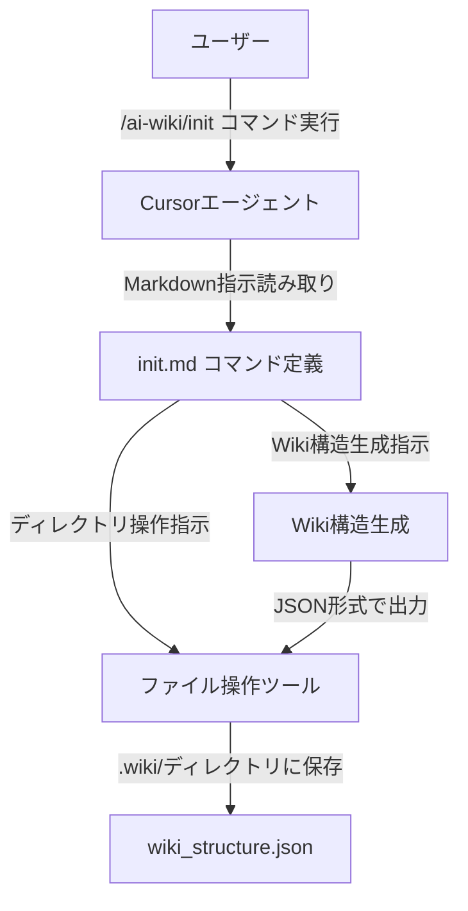
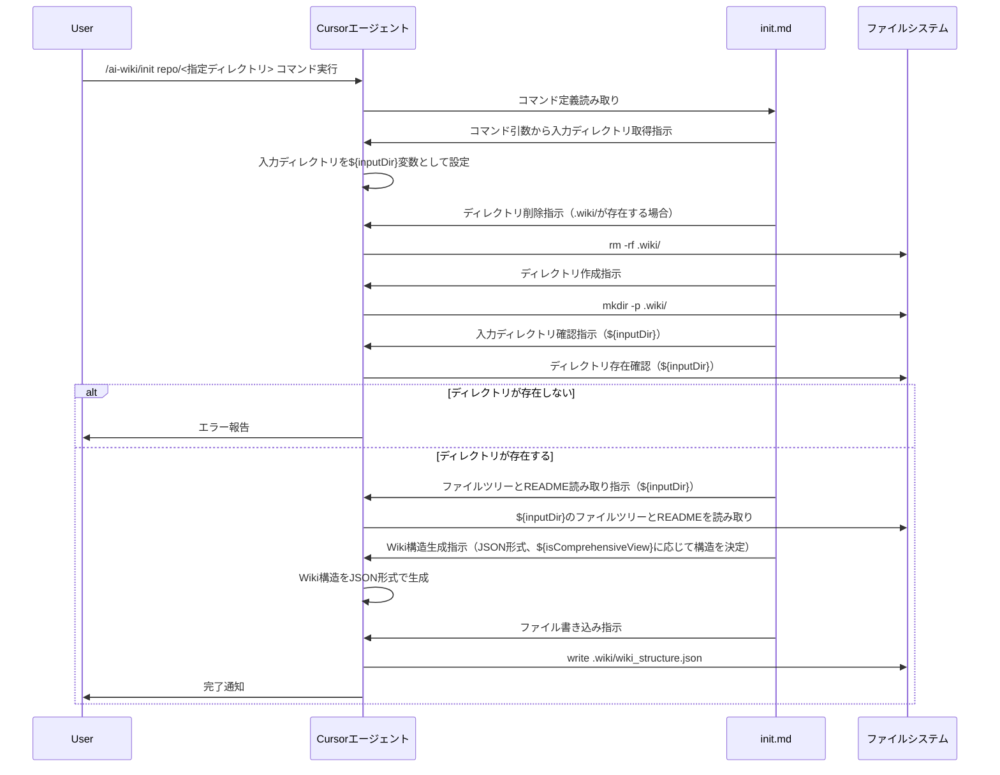

# Design Document: wiki-json-output

## Overview

この機能は、既存の`/ai-wiki/init`コマンドを拡張して、Wiki構造をXML形式ではなくJSON形式で出力し、`.wiki/`ディレクトリにファイルとして保存する機能を提供します。

**Purpose**: 開発者が`/ai-wiki/init`コマンドを実行した際に、Wiki構造をJSON形式で`.wiki/`ディレクトリに出力できるようにします。

**Users**: Cursorエージェントを使用してWiki構造を生成する開発者

**Impact**: 既存のXML出力機能をJSON出力機能に置き換え、ファイル出力機能を追加します。

### Goals
- XML形式からJSON形式への出力変更を実現
- `.wiki/`ディレクトリへのファイル出力機能を追加
- 再実行時のディレクトリ削除処理を実装
- `repo/<指定ディレクトリ>`形式での入力元指定に対応

### Non-Goals
- XML出力機能の維持（要件では置き換えを想定）
- 既存の変数展開パターン（`${language}`, `${isComprehensiveView}`など）の変更
- 多言語対応や包括的ビュー機能の変更

## Architecture

### Existing Architecture Analysis

**現在のアーキテクチャパターン**:
- Markdownベースのコマンド定義システム
- CursorエージェントがMarkdownファイルを読み取り、`<instructions>`セクションの指示に従って処理を実行
- 動的変数展開（`${variable}`形式）を使用
- 出力はXML形式のテキストとしてエージェントが生成

**既存のドメイン境界**:
- コマンド定義は`.cursor/commands/`ディレクトリに配置
- 各コマンドは独立したMarkdownファイル
- ファイル操作やディレクトリ操作はエージェントの動的処理に依存

**統合ポイント**:
- 既存の`init.md`コマンド定義ファイルを拡張
- 既存の変数展開パターンを維持
- 既存の多言語対応と包括的ビュー機能を維持

### Architecture Pattern & Boundary Map



**Architecture Integration**:
- **Selected pattern**: 既存コマンド拡張パターン（Extension Pattern）
- **Domain/feature boundaries**: コマンド定義レイヤー（`.cursor/commands/ai-wiki/init.md`）のみを変更
- **Existing patterns preserved**: 変数展開パターン、多言語対応、包括的ビュー機能
- **New components rationale**: 新規コンポーネントは不要、既存コマンド定義の拡張のみ
- **Steering compliance**: Markdownベースのコマンド定義パターンを維持

### Technology Stack

| Layer | Choice / Version | Role in Feature | Notes |
|-------|------------------|----------------|-------|
| Command Definition | Markdown | コマンド指示の定義 | 既存パターンを維持 |
| Runtime | Cursorエージェント | 指示の解釈と実行 | 既存の実行環境 |
| File Operations | Cursorエージェントツール | ディレクトリ作成・削除、ファイル書き込み | `write`, `run_terminal_cmd`ツールを使用 |
| Data Format | JSON | Wiki構造の出力形式 | XMLからJSONに変更 |

## System Flows



**Flow-level decisions**:
- 再実行時は`.wiki/`ディレクトリを削除してから新規作成（要件3）
- ディレクトリ不存在の場合はエラーを報告（要件4.2）
- JSON形式でWiki構造を生成してからファイルに書き込み（要件1, 2）

## Requirements Traceability

| Requirement | Summary | Components | Interfaces | Flows |
|-------------|---------|------------|------------|-------|
| 1.1 | JSON形式でのWiki構造出力 | Command Definition | JSON出力指示 | Wiki構造生成フロー |
| 1.2 | XML形式ではなくJSON形式 | Command Definition | 出力形式指定 | Wiki構造生成フロー |
| 1.3 | 有効なJSON構文準拠 | Command Definition | JSON構造定義 | Wiki構造生成フロー |
| 1.4 | XML形式と同等の情報提供 | Command Definition | JSON構造マッピング | Wiki構造生成フロー |
| 2.1 | .wiki/ディレクトリへの出力 | Command Definition | ファイル出力指示 | ファイル操作フロー |
| 2.2 | ディレクトリ自動作成 | Command Definition | ディレクトリ作成指示 | ファイル操作フロー |
| 2.3 | ワークスペースルートからの相対パス | Command Definition | パス指定 | ファイル操作フロー |
| 3.1 | 再実行時のディレクトリ削除 | Command Definition | ディレクトリ削除指示 | ファイル操作フロー |
| 3.2 | ディレクトリ全体の削除 | Command Definition | ディレクトリ削除指示 | ファイル操作フロー |
| 3.3 | 削除後の新規ファイル生成 | Command Definition | 削除→作成フロー | ファイル操作フロー |
| 4.1 | repo/<指定ディレクトリ>形式の入力 | Command Definition | 入力ディレクトリ指定 | 入力処理フロー |
| 4.2 | ディレクトリ不存在時のエラー報告 | Command Definition | エラーハンドリング | 入力処理フロー |
| 4.3 | ワークスペースルートからの相対パス認識 | Command Definition | パス解決 | 入力処理フロー |
| 4.4 | ディレクトリ内容の分析 | Command Definition | ファイルツリー取得 | Wiki構造生成フロー |
| 5.1 | Wiki構造の基本情報（タイトル、説明、セクション、ページ） | Command Definition | JSON構造定義 | Wiki構造生成フロー |
| 5.2 | ページ情報（タイトル、説明、重要度、関連ファイル、関連ページ） | Command Definition | JSON構造定義 | Wiki構造生成フロー |
| 5.3 | セクション階層構造（包括的ビューの場合） | Command Definition | JSON構造定義 | Wiki構造生成フロー |
| 5.4 | XML形式と同等の情報提供 | Command Definition | JSON構造マッピング | Wiki構造生成フロー |

## Components and Interfaces

| Component | Domain/Layer | Intent | Req Coverage | Key Dependencies (P0/P1) | Contracts |
|-----------|--------------|--------|--------------|--------------------------|-----------|
| Command Definition (init.md) | Command Layer | Wiki構造をJSON形式で生成し、.wiki/ディレクトリに出力 | 1.1-5.4 | Cursorエージェント (P0), ファイルシステム (P0) | Instruction Contract |

### Command Layer

#### Command Definition (init.md)

| Field | Detail |
|-------|--------|
| Intent | Wiki構造をJSON形式で生成し、.wiki/ディレクトリにファイルとして出力する指示を定義 |
| Requirements | 1.1, 1.2, 1.3, 1.4, 2.1, 2.2, 2.3, 3.1, 3.2, 3.3, 4.1, 4.2, 4.3, 4.4, 5.1, 5.2, 5.3, 5.4 |

**Responsibilities & Constraints**
- Wiki構造をJSON形式で生成する指示を提供
- `.wiki/`ディレクトリの作成・削除・ファイル出力の指示を提供
- `repo/<指定ディレクトリ>`形式の入力処理を提供
- 既存の変数展開パターン（`${language}`, `${isComprehensiveView}`など）を維持
- 既存の多言語対応と包括的ビュー機能を維持

**Dependencies**
- Inbound: Cursorエージェント — コマンド定義の読み取りと実行 (P0)
- Outbound: ファイルシステム — ディレクトリ操作とファイル書き込み (P0)
- External: なし

**Contracts**: Instruction [✓]

##### Instruction Contract

**指示の構造**:
- `<meta>`: コマンドのメタ情報
- `<background_information>`: 背景情報（空でも可）
- `<instructions>`: 実行指示（主要な変更箇所）

**指示の内容**:
1. **ディレクトリ削除指示**（再実行時）:
   - `.wiki/`ディレクトリが存在する場合、削除する
   - エージェントに`rm -rf .wiki/`を実行するよう指示

2. **ディレクトリ作成指示**:
   - `.wiki/`ディレクトリが存在しない場合、作成する
   - エージェントに`mkdir -p .wiki/`を実行するよう指示

3. **入力ディレクトリ取得と確認指示**:
   - コマンド引数から入力ディレクトリを取得する（例: `/ai-wiki/init repo/my-project`）
   - 取得したディレクトリパスを`${inputDir}`変数として設定（例: `repo/my-project`）
   - ワークスペースルートからの相対パスとして`${inputDir}`を解決（例: `repo/my-project` → `./repo/my-project`）
   - `${inputDir}`で指定されたディレクトリの存在確認を実行
   - 存在しない場合はエラーメッセージを報告し、処理を中断
   - 存在する場合は、そのディレクトリのファイルツリーとREADMEを読み取る

4. **Wiki構造生成指示**（JSON形式）:
   - XML形式ではなくJSON形式でWiki構造を生成
   - 既存のXML構造と同等の情報をJSON形式で表現
   - 包括的ビュー（`${isComprehensiveView}`が`true`）の場合: `sections`配列を含む完全なJSON構造を生成
   - 簡潔ビュー（`${isComprehensiveView}`が`false`）の場合: `sections`プロパティを省略し、`pages`配列のみを含むJSON構造を生成
   - ページの`parent_section`プロパティは包括的ビューの場合のみ含める

5. **ファイル書き込み指示**:
   - 生成されたJSON構造を`.wiki/wiki_structure.json`に書き込む
   - エージェントに`write`ツールを使用するよう指示

**Preconditions**:
- コマンドが正しく実行される（例: `/ai-wiki/init repo/my-project`）
- コマンド引数で入力ディレクトリが指定される（`repo/<指定ディレクトリ>`形式）
- ワークスペースが存在する
- エージェントがファイル操作ツールを使用可能
- エージェントがコマンド引数を取得し、変数展開（`${inputDir}`）が可能

**Postconditions**:
- `.wiki/wiki_structure.json`が生成される
- JSONファイルが有効なJSON構文に準拠している
- JSONファイルが既存のXML形式と同等の情報を含んでいる

**Invariants**:
- 既存の変数展開パターンが維持される
- 既存の多言語対応が維持される
- 既存の包括的ビュー機能が維持される

**Implementation Notes**
- **Integration**: 既存の`init.md`を修正して、XML出力指示をJSON出力指示に変更し、ファイル操作の指示を追加
- **Validation**: JSON構造が有効なJSON構文に準拠していることを確認
- **Risks**: エージェントのファイル操作能力が期待通りでない可能性（明示的な指示で緩和）

## Data Models

### Domain Model

**Wiki構造エンティティ**:
- **WikiStructure**: Wiki全体の構造（タイトル、説明、セクション、ページ）
- **Section**: セクション情報（ID、タイトル、ページ参照、サブセクション参照）
- **Page**: ページ情報（ID、タイトル、説明、重要度、関連ファイル、関連ページ、親セクション）

**集約ルート**: WikiStructure

**不変条件**:
- ページは必ず親セクションを持つ（包括的ビューの場合）
- ページ参照は有効なページIDを参照する
- セクション参照は有効なセクションIDを参照する

### Logical Data Model

**JSON構造定義**:

```json
{
  "title": "string",
  "description": "string",
  "sections": [
    {
      "id": "string",
      "title": "string",
      "pages": ["string"],
      "subsections": ["string"]
    }
  ],
  "pages": [
    {
      "id": "string",
      "title": "string",
      "description": "string",
      "importance": "high|medium|low",
      "relevant_files": ["string"],
      "related_pages": ["string"],
      "parent_section": "string"
    }
  ]
}
```

**構造の説明**:
- `title`: Wiki全体のタイトル
- `description`: Wiki全体の説明
- `sections`: セクションの配列（包括的ビュー（`${isComprehensiveView}`が`true`）の場合のみ存在。簡潔ビューの場合はこのプロパティ自体を省略）
- `pages`: ページの配列（常に存在）
- セクション階層は`subsections`配列で表現
- ページとセクションの関連は`parent_section`で表現（包括的ビューの場合のみ`parent_section`が存在）

**簡潔ビュー時のJSON構造**:
簡潔ビュー（`${isComprehensiveView}`が`false`）の場合、`sections`プロパティは省略されます。JSON構造は以下のようになります：

```json
{
  "title": "string",
  "description": "string",
  "pages": [
    {
      "id": "string",
      "title": "string",
      "description": "string",
      "importance": "high|medium|low",
      "relevant_files": ["string"],
      "related_pages": ["string"]
    }
  ]
}
```

注意: 簡潔ビューの場合、ページオブジェクトに`parent_section`プロパティは含まれません。

**一貫性と整合性**:
- ページ参照（`pages`配列内のID）は有効なページIDを参照
- セクション参照（`subsections`配列内のID）は有効なセクションIDを参照（包括的ビューの場合のみ）
- ページの`parent_section`は有効なセクションIDを参照（包括的ビューの場合のみ存在）
- 簡潔ビューの場合、`sections`プロパティとページの`parent_section`プロパティは存在しない

### Data Contracts & Integration

**JSON出力形式**:
- ファイル名: `wiki_structure.json`
- エンコーディング: UTF-8
- 形式: 有効なJSON構文に準拠
- 構造: 上記のLogical Data Modelに準拠

**XML構造とのマッピング**:
- `<wiki_structure>` → ルートオブジェクト
- `<title>` → `title`プロパティ
- `<description>` → `description`プロパティ
- `<sections>` → `sections`配列
- `<section>` → `sections`配列の要素
- `<pages>` → `pages`配列
- `<page>` → `pages`配列の要素
- 各XML要素の属性と子要素はJSONオブジェクトのプロパティにマッピング

## Error Handling

### Error Strategy

エラーハンドリングはエージェントへの明示的な指示として実装します。

### Error Categories and Responses

**User Errors**:
- **ディレクトリ不存在**: `repo/<指定ディレクトリ>`が存在しない場合
  - エージェントにエラーメッセージを報告するよう指示
  - 処理を中断

**System Errors**:
- **ディレクトリ作成失敗**: `.wiki/`ディレクトリの作成に失敗した場合
  - エージェントにエラーメッセージを報告するよう指示
  - 処理を中断
- **ファイル書き込み失敗**: JSONファイルの書き込みに失敗した場合
  - エージェントにエラーメッセージを報告するよう指示
  - 処理を中断

**Business Logic Errors**:
- **JSON生成失敗**: Wiki構造のJSON生成に失敗した場合
  - エージェントにエラーメッセージを報告するよう指示
  - 処理を中断

### Monitoring

エラーハンドリングはエージェントの標準的なエラー報告機能に依存します。明示的なエラーハンドリングの指示をコマンド定義に含めます。

## Testing Strategy

### Unit Tests
- JSON構造の生成ロジック（エージェントが実行）
- XML構造からJSON構造へのマッピング（エージェントが実行）

### Integration Tests
- ディレクトリ操作とファイル出力の統合（エージェントが実行）
- 入力ディレクトリの確認とエラーハンドリング（エージェントが実行）

### E2E Tests
- コマンド実行からJSONファイル生成までの完全なフロー（エージェントが実行）
- 再実行時のディレクトリ削除と再生成（エージェントが実行）

**注意**: この機能はCursorエージェントが動的に実行するため、実際のテストはエージェントの実行時に検証されます。設計段階では、エージェントへの指示が明確であることを確認します。
