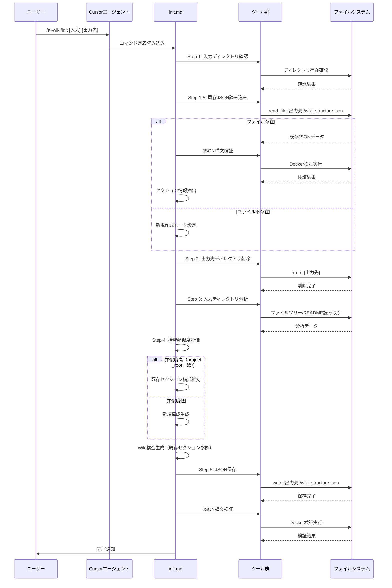

# Design Document: wiki-section-persistence

## Overview

この機能は、`/ai-wiki/init`コマンドを拡張し、既存の`wiki_structure.json`ファイルから前回のセクション情報を読み込み、その構成を維持しながらWiki構造を更新する機能を提供します。

**Purpose**: ユーザーが`/ai-wiki/init`コマンドを再実行する際に、既存のセクション構造、ページ階層、関連ページの関係性を保持することで、一貫性のあるWiki管理を実現します。

**Users**: Cursorエージェントを使用してWiki構造を生成・更新する開発者

**Impact**: 既存の`init.md`コマンド定義に新しい処理ステップを追加し、既存の`wiki_structure.json`を読み込んでセクション情報を維持する機能を実装します。

### Goals
- 既存の`wiki_structure.json`を読み込んでセクション情報を取得
- 既存のセクション構成を維持しながら新しいWiki構造を生成
- 構成類似度を評価し、適切に構成維持の判断を実行
- 既存のページIDとセクションIDのマッピングを保持

### Non-Goals
- 既存のWikiページコンテンツの更新（`/ai-wiki/make`コマンドの責務）
- セクション構造の手動編集機能
- 複数の`wiki_structure.json`ファイルの統合

## Architecture

### Existing Architecture Analysis

**現在のアーキテクチャパターン**:
- Markdownベースのコマンド定義システム
- CursorエージェントがMarkdownファイルを読み取り、`<instructions>`セクションの指示に従って処理を実行
- 動的変数展開（`${variable}`形式）を使用
- 既存の`init.md`コマンドでJSON検証、ディレクトリ操作、エラーハンドリングのパターンが確立

**既存のドメイン境界**:
- コマンド定義は`.cursor/commands/`ディレクトリに配置
- 各コマンドは独立したMarkdownファイル
- ファイル操作やディレクトリ操作はエージェントの動的処理に依存

**統合ポイント**:
- 既存の`init.md`コマンド定義ファイルに新しいステップ（Step 1.5）を追加
- 既存のJSON検証パターン（Docker使用）を再利用
- 既存の`make.md`コマンドのJSON読み込みパターンを参考に実装

### Architecture Pattern & Boundary Map

```mermaid
graph TB
    User[ユーザー] -->|/ai-wiki/init コマンド実行| CursorAgent[Cursorエージェント]
    CursorAgent -->|Markdown指示読み取り| CommandDef[init.md コマンド定義]
    CommandDef -->|Step 1.5: 既存JSON読み込み| ReadFile[read_file ツール]
    ReadFile -->|wiki_structure.json| ExistingJSON[既存JSON構造]
    CommandDef -->|Step 2: ディレクトリ削除| FileOps[run_terminal_cmd ツール]
    FileOps -->|rm -rf [出力先]| OutputDir[出力先ディレクトリ]
    CommandDef -->|Step 3: 入力分析| Analysis[ファイルツリー/README分析]
    CommandDef -->|Step 4: 構成比較| Compare[構成類似度評価]
    Compare -->|類似度高| Maintain[既存構成維持]
    Compare -->|類似度低| NewStruct[新規構成生成]
    CommandDef -->|Step 4: Wiki構造生成| Generate[Wiki構造生成]
    Generate -->|既存セクション参照| WikiStruct[Wiki構造JSON]
    CommandDef -->|Step 5: JSON保存| WriteFile[write ツール]
    WriteFile -->|wiki_structure.json| OutputDir
```

**Architecture Integration**:
- Selected pattern: 既存コマンド定義の拡張パターン
- Domain/feature boundaries: コマンド定義ファイル内で完結し、外部コンポーネントへの依存なし
- Existing patterns preserved: JSON検証（Docker使用）、ディレクトリ操作、エラーハンドリングのパターンを再利用
- New components rationale: 既存の`init.md`に新しいステップを追加することで、既存の処理フローを維持しつつ、セクション情報の維持機能を追加
- Steering compliance: Markdownベースのコマンド定義システム、日本語優先、Spec-Driven Developmentの原則を維持

### Technology Stack

| Layer | Choice / Version | Role in Feature | Notes |
|-------|------------------|-----------------|-------|
| CLI / Commands | Cursorエージェントコマンドシステム | コマンド実行環境 | 既存の技術スタック |
| Data / Storage | JSON | `wiki_structure.json`の読み込みと保存 | 既存の技術スタック |
| Infrastructure / Runtime | Docker (python:3-alpine) | JSON検証に使用 | 既存のパターンを再利用 |
| File System | Markdown/JSON | Wiki構造の生成と保存 | 既存の技術スタック |

## System Flows

### Wiki構造更新フロー（既存JSONあり）



## Requirements Traceability

| Requirement | Summary | Components | Interfaces | Flows |
|-------------|---------|------------|------------|-------|
| 1.1-1.6 | 既存のwiki_structure.jsonの読み込みと検証 | JSON読み込み処理、JSON検証処理 | read_fileツール、Docker検証 | Wiki構造更新フロー |
| 2.1-2.7 | セクション構成の維持 | セクション維持ロジック、構成比較処理 | 既存JSONデータ構造 | Wiki構造更新フロー |
| 3.1-3.6 | ページとセクションの関連性の維持 | ページIDマッピング、関連性維持ロジック | 既存JSONデータ構造 | Wiki構造更新フロー |
| 4.1-4.5 | 更新時の構成比較と判断 | 構成類似度評価、判断ロジック | 既存JSONデータ構造、新規分析結果 | Wiki構造更新フロー |
| 5.1-5.5 | 更新されたwiki_structure.jsonの保存 | JSON保存処理、JSON検証処理 | writeツール、Docker検証 | Wiki構造更新フロー |

## Components and Interfaces

### コマンド定義拡張

#### init.mdコマンド定義拡張

| Field | Detail |
|-------|--------|
| Intent | `/ai-wiki/init`コマンドに既存の`wiki_structure.json`読み込みとセクション維持機能を追加 |
| Requirements | 1.1-1.6, 2.1-2.7, 3.1-3.6, 4.1-4.5, 5.1-5.5 |

**Responsibilities & Constraints**
- 既存の`init.md`コマンド定義に新しいステップ（Step 1.5）を追加
- 既存の処理フロー（Step 1-5）を維持しつつ、セクション情報の維持機能を統合
- 既存のJSON検証パターン（Docker使用）を再利用
- 既存のエラーハンドリングパターンを維持

**Dependencies**
- Inbound: なし
- Outbound: 
  - `read_file`ツール — 既存JSONファイルの読み込み (P0)
  - `write`ツール — 更新されたJSONファイルの保存 (P0)
  - `run_terminal_cmd`ツール — ディレクトリ操作とJSON検証 (P0)
  - `list_dir`ツール — ファイルツリーの取得 (P0)
- External: 
  - Docker (python:3-alpine) — JSON検証に使用 (P0)

**Contracts**: Batch [X]

##### Batch / Job Contract
- Trigger: `/ai-wiki/init [指定ディレクトリ] [出力先ディレクトリ]`コマンド実行
- Input / validation: 
  - 入力ディレクトリの存在確認
  - 既存の`wiki_structure.json`ファイルの存在確認（オプション）
  - JSON構文検証（既存JSONが存在する場合）
- Output / destination: 
  - `[出力先ディレクトリ]/wiki_structure.json`ファイル
  - 既存のセクション情報を維持したWiki構造JSON
- Idempotency & recovery: 
  - コマンドの再実行により、既存の構成を維持しながらWiki構造を更新
  - JSON構文エラーの場合は新規作成モードにフォールバック

**Implementation Notes**
- Integration: 既存の`init.md`コマンド定義にStep 1.5を追加し、既存の処理フローを維持
- Validation: JSON構文検証は既存のDockerパターンを再利用
- Risks: 
  - 既存のJSONファイルが破損している場合のエラーハンドリング
  - 構成類似度の評価ロジックの複雑さ

#### セクション維持ロジック（コマンド定義内）

| Field | Detail |
|-------|--------|
| Intent | 既存のセクション構成を維持しながら新しいWiki構造を生成 |
| Requirements | 2.1-2.7, 3.1-3.6, 4.1-4.5 |

**Responsibilities & Constraints**
- 既存の`sections`配列を保持
- 既存のセクションID、タイトル、階層構造を維持
- 既存のページIDとセクションIDのマッピングを保持
- 新規分析結果と既存構成の類似度を評価

**Dependencies**
- Inbound: 
  - 既存の`wiki_structure.json`データ — セクション情報の取得 (P0)
  - 新規分析結果 — ファイルツリーとREADME (P0)
- Outbound: 
  - 更新されたWiki構造JSON — セクション情報を維持した構造 (P0)

**Contracts**: State [X]

##### State Management
- State model: 
  - 既存のセクション構成（`sections`配列、セクションID、タイトル、階層構造）
  - 既存のページIDとセクションIDのマッピング
  - 新規分析結果（ファイルツリー、README、推測されるWiki構造）
- Persistence & consistency: 
  - 既存の`wiki_structure.json`から読み込んだセクション情報をメモリ上で保持
  - 新規Wiki構造生成時に既存のセクション情報を参照
- Concurrency strategy: 
  - シーケンシャル処理（コマンド定義内で順次実行）

**Implementation Notes**
- Integration: コマンド定義のStep 4（Wiki構造生成）内で既存のセクション情報を参照
- Validation: 構成類似度評価により、適切な構成維持の判断を実行
- Risks: 
  - 既存のページIDと新規分析結果のマッチングが困難な場合
  - 構成類似度の評価が不適切な場合

## Data Models

### Domain Model

**Wiki構造エンティティ**:
- `WikiStructure`: ルートエンティティ
  - `title`: Wikiのタイトル
  - `description`: Wikiの説明
  - `project_root`: プロジェクトのルートディレクトリ
  - `sections`: セクション配列
  - `pages`: ページ配列

**セクションエンティティ**:
- `Section`: セクション定義
  - `id`: セクションID（一意）
  - `title`: セクションタイトル
  - `pages`: ページID配列
  - `subsections`: サブセクションID配列

**ページエンティティ**:
- `Page`: ページ定義
  - `id`: ページID（一意）
  - `title`: ページタイトル
  - `description`: ページの説明
  - `importance`: 重要度（high/medium/low）
  - `relevant_files`: 関連ファイルパス配列
  - `related_pages`: 関連ページID配列
  - `parent_section`: 親セクションID

### Logical Data Model

**Structure Definition**:
- `WikiStructure`と`Section`、`Page`の関係は1対多
- 各`Page`は1つの`Section`に属する（`parent_section`プロパティ）
- 各`Section`は複数の`Page`を含む（`pages`配列）
- セクション間の階層関係は`subsections`配列で表現

**Consistency & Integrity**:
- セクションIDとページIDは一意である必要がある
- ページの`parent_section`は有効なセクションIDを参照する必要がある
- セクションの`pages`配列内のページIDは有効なページIDを参照する必要がある
- セクションの`subsections`配列内のセクションIDは有効なセクションIDを参照する必要がある

## Error Handling

### Error Strategy

既存のエラーハンドリングパターンを維持しつつ、新しいエラーケースに対応します。

### Error Categories and Responses

**User Errors** (4xx):
- 既存の`wiki_structure.json`が存在しない場合 → 新規作成モードとして処理を続行
- JSON構文が無効な場合 → エラーメッセージを報告し、処理を中断

**System Errors** (5xx):
- ファイル読み込み失敗 → エラーメッセージを報告し、処理を中断
- JSON検証失敗（Dockerエラー） → エラーメッセージを報告し、処理を中断
- ファイル書き込み失敗 → エラーメッセージを報告し、処理を中断

**Business Logic Errors** (422):
- 構成類似度評価で不整合が検出された場合 → 新規構成を採用（構成維持をスキップ）

### Monitoring

- JSON構文検証の成功/失敗をログに記録
- 構成維持の判断結果（維持/新規生成）をユーザーに報告
- エラー発生時は具体的なエラーメッセージを報告

## Testing Strategy

### Unit Tests
- 既存の`wiki_structure.json`読み込み処理のテスト
- JSON構文検証処理のテスト
- セクション情報抽出処理のテスト
- 構成類似度評価ロジックのテスト
- セクション維持ロジックのテスト

### Integration Tests
- 既存JSONありの場合のWiki構造更新フローのテスト
- 既存JSONなしの場合の新規作成フローのテスト
- 構成類似度が低い場合の新規構成生成フローのテスト
- JSON検証（Docker）の統合テスト

### E2E Tests
- `/ai-wiki/init`コマンドの完全な実行フローのテスト
- 既存のセクション情報が維持されることの確認
- 更新された`wiki_structure.json`が正しく保存されることの確認

